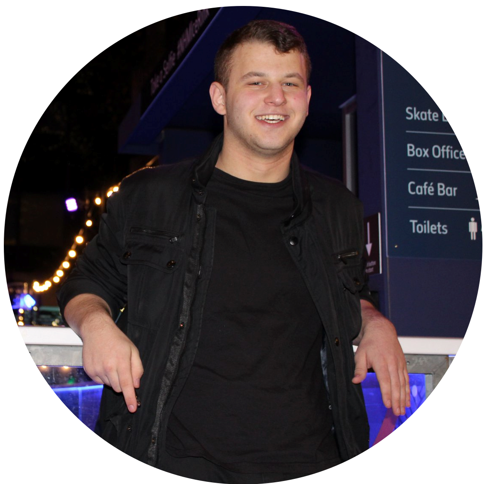

Hi, I'm Sam Karet. I recently graduated from Imperial College London with a Master's in Biomedical Engineering.  
I'm a passionate problem solver with wide ranging interests, and experience with medical devices, robotics, and 3D printing.

My degree involved various modules regarding biomechanics, medical imaging, and programming, as well as a variety of opportunities for project work, both large and small. Here are some examples of projects I worked on during my course:  
- A volumetric infrared imaging system (VIRIS) for the diagnoses and monitoring of breast-cancer related lymphoedema.
- A raspberry pi controlled robotic model tank with a turret to fire foam pellets. (For the Pi Wars Competition)  
- A digital stethoscope. 
- A bicycle pedal with live force feedback for a paraplegic athlete to use on a FES bike in the Cybathlon.  
- An arm wrestling arcade game.  
- Synthetic biological toggle switches.  

I have experience working in both mechanical and electrical workshops, as well as in wet labs. I consider myself a 'maker' and a tinkerer and have skills in prototyping and working with microcontrollers. My experience using C++, python, and MATLAB has contributed to my ability to quickly pick up the usage of other programming languages.  
I am currently looking for work so feel free to reach out and contact me about any roles you think I'm suitable for.

My LinkedIn: <a href="https://www.linkedin.com/in/sam-karet/" target="_blank">https://www.linkedin.com/in/sam-karet/</a>  
My GitHub: <a href="https://github.com/SamKaret" target="_blank">https://github.com/SamKaret</a>